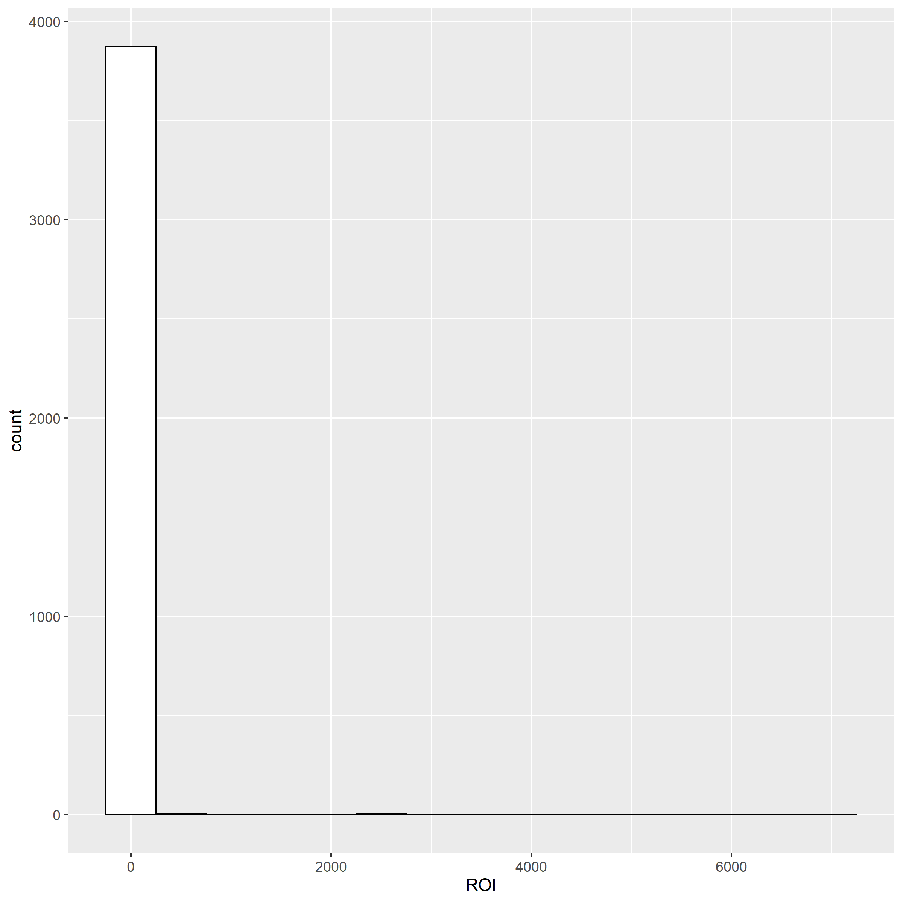

```{r setup, include=FALSE}
library(knitr)
# change to your own working directory

knitr::opts_knit$set(root.dir = "C:/Users/Elmer/Documents/R/Statistical Modeling/PSET2")


setwd("C:/Users/Elmer/Documents/R/Statistical Modeling/PSET2")

# set seed to your own favorite number
set.seed(1818)
options(width=70)

# general rchunk code options
opts_chunk$set(tidy.opts=list(width.wrap=50),tidy=TRUE, size = "vsmall")
opts_chunk$set(message = FALSE,
               warning = FALSE,
               cache = TRUE,
               autodep = TRUE,
               cache.comments = FALSE,
               collapse = TRUE,
               fig.width = 5,  
               fig.height = 4,
               fig.align='center')


```

## Libraries Needed
```{r}
library("tidyverse")
library("ggplot2") 
```

## Question 1 ISLR Ch.2 Q.2

A. Regression. n(sample) = whatever subset we pick, p(predictors) = the vars

B. Classification. n = 20 similair products, p = success, failure, price, mark      budget, comp price, and 10 other vars

C. Regression because output is expected to be a percentage (aka continuous data)
   Prediction because we are forcasting future percentage change
   (n = 52, p = % change in [USD/Euro, US Market, British Market, German Market])

## Question 2 ISLR Ch.2 Q.4

A. 
Classifying faces on images, Response: yes or no, Predictors: nose, eyes, jaw, etc...
Applicational Goal: Predictive because objects on the images are being categorized
   
Classifying whether or not to give someone 1 of 3 loan, Response: small, medium, large     
Predictors: income, networth, credit history, etc...
Applicational Goal: Prediction because output is being categorized into 3 types of loans 
   
Classifying whether someone is a male or female based on previous purchases
Response: male or female     
Predictors: types of purchases, stores of purchases
Applicational Goal: Inference because you are exploring the relationship of previous purchases 
   
B. 
Using a regression model to examine the relationship of marijuana dispensaries and crime in a location
Response: Reported crimes in a given location
Predictors: Marijuana dispensary locations, historical crime reports in locations 
Applicational Goal: Inference because you are exploring the relationship between crime and  marijuana dispensary within a specified location 


Using a regression model to predict a sports teams number of points in a game
Response: Points in a game
Predictors: Individual player points per game average, defensive stats of the oponent 
Applicational Goal: Predictive because you are estimating 
   
Using a regression model to predict percent change in a stock 
Response: Predicted percent change stock
Predictors: Previous percent change of stock, media coverage
Applicational Goal: Predictive because you are estimating a future variable

C. 
Using cluster analysis to group businesses together by what they sell
Using cluster analysis to group people by income
Using cluster analysis to group people interests/facebook likes

## Question 3a-b Plotting IMDB’s Top 5000 Movies

```{r}
movies <-read.csv("data/movie_metadata.csv")

movies <- movies %>% filter(budget<4e+08) #get rid of anomolies

movies <- movies %>% mutate(genre_main = unlist(map(strsplit(as.character(movies$genres),
"\\|"), 1)), grossM = gross/1e+06,
             budgetM = budget/1e+06)

movies <- movies %>% mutate(genre_main = factor(genre_main)%>%
                            fct_drop())
```

## Question 3c Profit and ROI

```{r}
movies <- movies %>% 
  mutate(profitM = grossM - budgetM,
         ROI = profitM / budgetM)
```

## Question 3d Average ROI Plot

```{r}
sum(is.na(movies$ROI))
movies <- movies %>% drop_na(ROI) #omits NA values in a column 
sum(is.na(movies$ROI))

cat('average ROI is', mean(movies$ROI))

hgp1<-ggplot(movies, aes(x=ROI)) + 
  geom_histogram(color="black", fill="white", binwidth = 500)

```



\newpage

## Question 3e Outliers and Filtering

```{r}
count(movies, vars = ROI > 10)

movies_filt <- movies %>% filter(ROI < 10) #we want/keep everything < 10 

count(movies_filt, vars = ROI > 10)

hp2 <- ggplot(data = movies_filt, aes(ROI))+
  geom_histogram(color="black", fill="white", binwidth = 1)
```


\newpage

## Question 3f Grouping and Summarizing

```{r}
average_roi_bycat <- movies_filt %>% 
  group_by(genre_main) %>% 
  summarize(mean(ROI))

average_roi_bycat

cat("Top 3 Genres: Musical, Western, and Thriller")
```

## Question 3g 

```{r}
genre_meanROI <- average_roi_bycat$`mean(ROI)`
genre <- average_roi_bycat$genre_main

sp1 <- ggplot( data = average_roi_bycat)+ 
  geom_point(mapping = aes(x = genre, y = genre_meanROI)) +
  labs(x= "Genre",
       y= "Average(ROI)",
       title= "Average ROI by Genre")
```


\newpage

## Question 3h

```{r}
test3 <- group_by(movies_filt,actor_1_name)

df2 <- summarise(test3,mean(ROI),mean(profitM),num_films = n())
x2 <- df2$`mean(ROI)`
df2 <- df2 %>% arrange(desc(x2))


df2 <- df2 %>% slice(1:20)

df2
```

## Question 3i

```{r}
df3 <- summarise(test3,mean(ROI))
y3 <- df3$actor_1_name
x3 <- df3$`mean(ROI)`
df3 <- df3 %>% arrange(desc(x3))
df3 <- df3 %>% slice(1:30)
y3 <- df3$actor_1_name
x3 <- df3$`mean(ROI)`
df3

sp2 <- ggplot(df3 = df3 %>% top_n(30, wt = x3), 
              mapping = aes(x = x3, y = reorder(y3, x3)))+
              geom_point()
```

\newpage


\newpage
## Question 3j

```{r}
df4 <- summarise(test3,mean(ROI))
y4 <- df4$actor_1_name
x4 <- df4$`mean(ROI)`
df4 <- df4 %>% arrange((x4))
df4 <- df4 %>% slice(30:1)
y4 <- df4$actor_1_name
x4 <- df4$`mean(ROI)`

sp3 <- ggplot(df4 = df4 %>% top_n(30, wt = x4),
              mapping = aes(x = x4, y = reorder(y4, x4)))+
              geom_point()
```

\newpage

